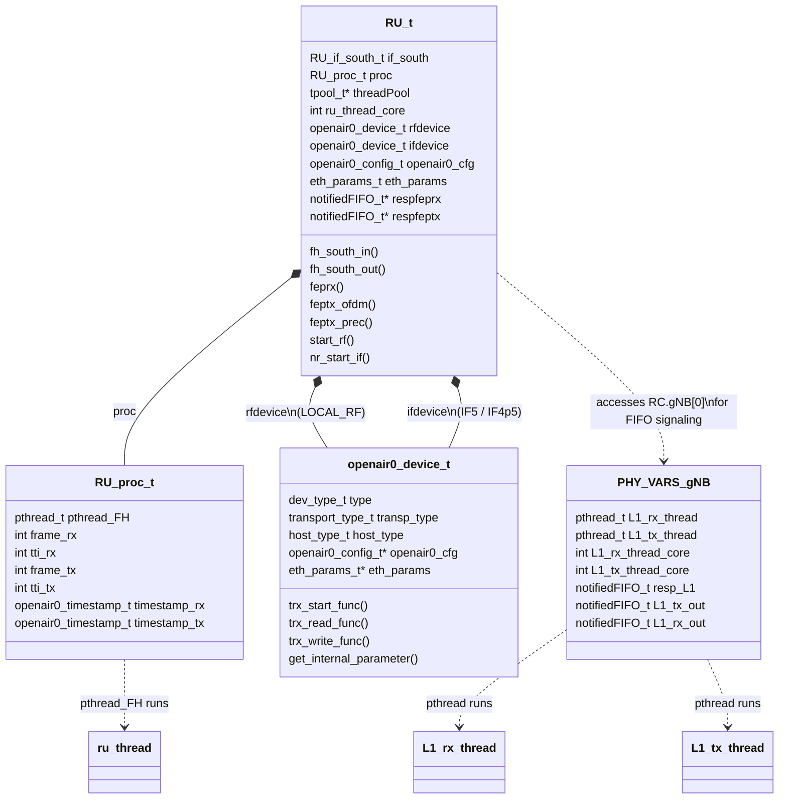
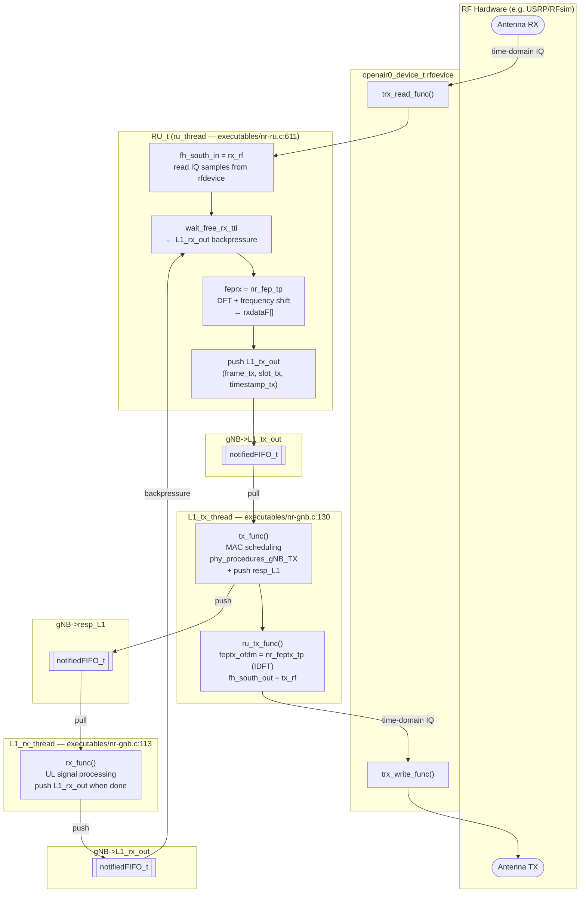
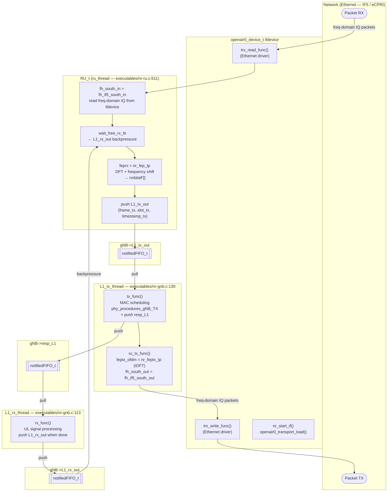
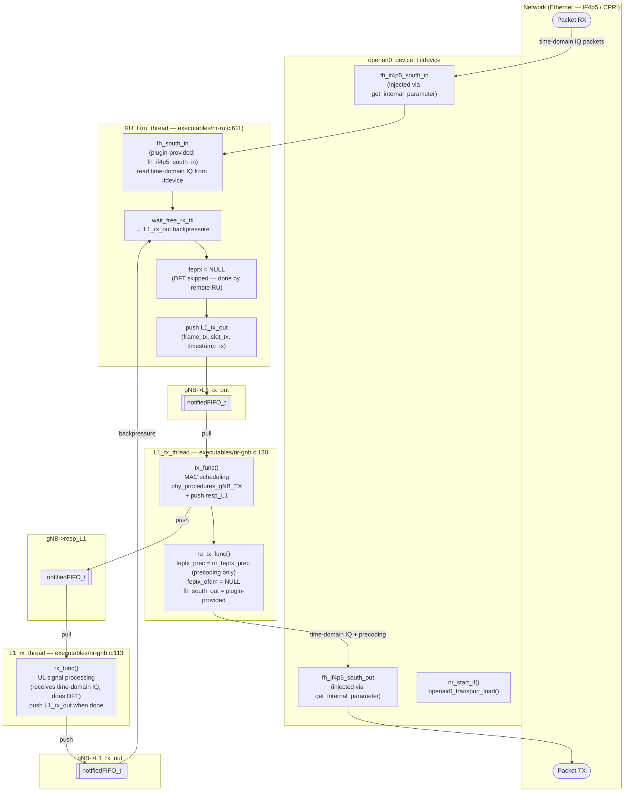

# NR Radio Unit Thread Architecture

This document describes the connections between `ru_thread`, `L1_tx_thread`, `L1_rx_thread`,
`RU_t`, and `openair0_device_t` for the three southbound interface types: `LOCAL_RF`,
`REMOTE_IF5`, and `REMOTE_IF4p5`.

**Key source files:**
- `executables/nr-ru.c` — `ru_thread`, `ru_tx_func`, `set_function_spec_param()`
- `executables/nr-gnb.c` — `L1_rx_thread`, `L1_tx_thread`, `tx_func()`, `rx_func()`
- `openair1/PHY/defs_RU.h` — `RU_t`, `RU_proc_t`, `RU_if_south_t`
- `radio/COMMON/common_lib.h` — `openair0_device_t`

---

## 1. Structure Relationships

---

## 2. Notification FIFOs (common to all interface types)

Three `notifiedFIFO_t` queues inside `PHY_VARS_gNB` coordinate the three threads:

| FIFO | Producer | Consumer | Purpose |
|------|----------|----------|---------|
| `L1_tx_out` | `ru_thread` | `L1_tx_thread` | Trigger TX slot processing |
| `resp_L1` | `L1_tx_thread` (inside `tx_func`) | `L1_rx_thread` | Trigger RX slot processing |
| `L1_rx_out` | `L1_rx_thread` (inside `rx_func`) | `ru_thread` | Backpressure: signal RX slot done |

---

## 3. LOCAL_RF

**Concept:** Integrated RF — the gNB controls the radio hardware directly.  
Both DFT/IDFT and RF I/O happen locally.

**Function pointer assignments** (`set_function_spec_param`, `nr-ru.c:895`):

| Pointer | Value |
|---------|-------|
| `fh_south_in` | `rx_rf` |
| `fh_south_out` | `tx_rf` |
| `feprx` | `nr_fep_tp` (DFT + frequency shift) |
| `feptx_ofdm` | `nr_feptx_tp` (IDFT + precoding) |
| `feptx_prec` | `NULL` |
| `nr_start_if` | `NULL` |
| `start_rf` | `start_rf` |
| Device used | `rfdevice` |

---

## 4. REMOTE_IF5

**Concept:** Frequency-domain fronthaul (split 7 / CPRI IF5). IQ samples in the frequency
domain are transported over Ethernet. DFT/IDFT still runs locally on the RAU/gNB side.

**Function pointer assignments** (`set_function_spec_param`, `nr-ru.c:913`):

| Pointer | Value |
|---------|-------|
| `fh_south_in` | `fh_if5_south_in` |
| `fh_south_out` | `fh_if5_south_out` |
| `feprx` | `nr_fep_tp` (DFT + frequency shift) |
| `feptx_ofdm` | `nr_feptx_tp` (IDFT + precoding) |
| `feptx_prec` | `NULL` |
| `nr_start_if` | `nr_start_if` |
| `start_rf` | `start_streaming` (UDP/eCPRI) or `NULL` |
| Device used | `ifdevice` (Ethernet transport) |

---

## 5. REMOTE_IF4p5

**Concept:** Time-domain fronthaul (split 7.2 / CPRI IF4p5). Raw time-domain IQ samples are
transported over Ethernet. DFT/IDFT is **not** performed by the RU — only precoding runs
locally. The fronthaul functions (`fh_south_in`/`fh_south_out`) are initially `NULL` and are
injected at runtime by the transport plugin via `ifdevice.get_internal_parameter()` (see
`nr-ru.c:647–652`).

No `threadPool` or `respfeprx`/`respfeptx` FIFOs are created for this interface type
(`nr-ru.c:1008`).

**Function pointer assignments** (`set_function_spec_param`, `nr-ru.c:930`):

| Pointer | Value |
|---------|-------|
| `fh_south_in` | `NULL` → overridden by transport plugin (`fh_if4p5_south_in`) |
| `fh_south_out` | `NULL` → overridden by transport plugin (`fh_if4p5_south_out`) |
| `feprx` | `NULL` (no DFT in RU) |
| `feptx_ofdm` | `NULL` (no IDFT in RU) |
| `feptx_prec` | `nr_feptx_prec` (precoding only) |
| `nr_start_if` | `nr_start_if` |
| `start_rf` | `NULL` (no local RF) |
| Device used | `ifdevice` (Ethernet transport) |

---

## 6. Comparison Table

| Feature | LOCAL_RF | REMOTE_IF5 | REMOTE_IF4p5 |
|---------|----------|------------|--------------|
| Device used | `rfdevice` | `ifdevice` | `ifdevice` |
| Transport | Local RF (USRP, …) | Ethernet (IF5/eCPRI) | Ethernet (IF4p5/CPRI) |
| `fh_south_in` | `rx_rf` | `fh_if5_south_in` | Plugin-provided (`fh_if4p5_south_in`) |
| `fh_south_out` | `tx_rf` | `fh_if5_south_out` | Plugin-provided (`fh_if4p5_south_out`) |
| `feprx` | `nr_fep_tp` (DFT) | `nr_fep_tp` (DFT) | `NULL` |
| `feptx_ofdm` | `nr_feptx_tp` (IDFT) | `nr_feptx_tp` (IDFT) | `NULL` |
| `feptx_prec` | `NULL` | `NULL` | `nr_feptx_prec` |
| Time-domain buffers | Allocated | Allocated | Not allocated |
| `threadPool` / FEP FIFOs | Yes | Yes | No |
| `nr_start_if` | `NULL` | `nr_start_if` | `nr_start_if` |
| `start_rf` | `start_rf` | `start_streaming` or `NULL` | `NULL` |
| IQ domain at fronthaul | Time-domain | Frequency-domain | Time-domain |
| DFT/IDFT location | RAU (gNB side) | RAU (gNB side) | Remote RU (split) |
